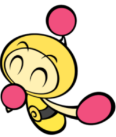

    

# Indie Studio - Time to go cross-platform

- **Binary name:** bomberman
- **Language:** C++
- **Compilation:** CMake 3.17

# Chararter List

## RED

    

The fiery leader of the bombermen , Red has a fiery temperament and always follow justice

## BLUE

    

The brains of the team , Blue is always lazy but always rises up to the cvhallenges 

## YELLOW

    

Yellow has a tragic backstory but due to that always strives to make his fellow bombermen happy

## GREEN

    

Green is a traitor and secretly works for the evil doctor 

