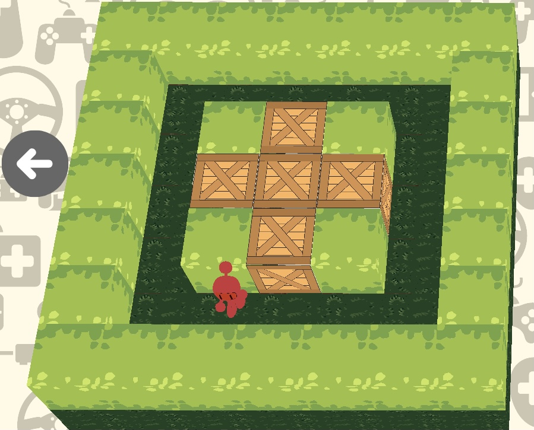
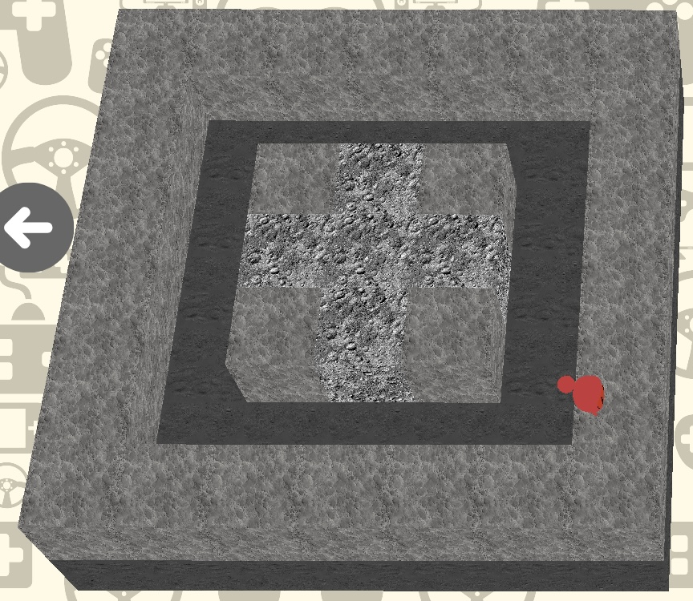
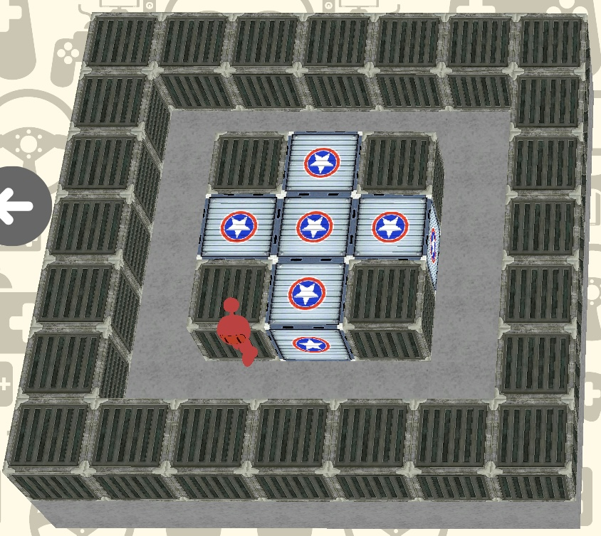
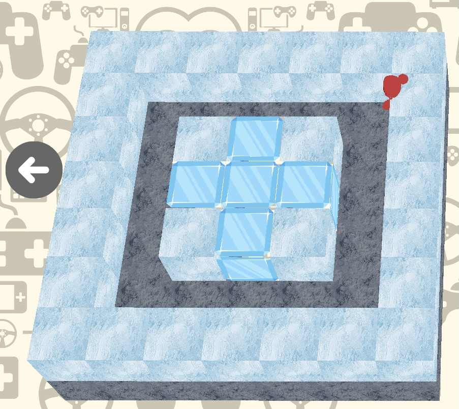

    

# Indie Studio - Time to go cross-platform

- **Binary name:** bomberman
- **Language:** C++
- **Compilation:** CMake 3.17

# Maps List

## EARTH KINGDOM

    

The prosperous land of the bombermen filled with sunshine and love

## STONE WORLD

    

The world inhabited by the evil profesor

## CIVIL WARSHIP BASE

    

The human bomberman allince ship which houses the potential to destroy the bomb world

## ICE NEBULA NEXUS

    

A piece of the bomb of the orging is said to be frozen somewhere under ths ice of the ice nebule nexus
